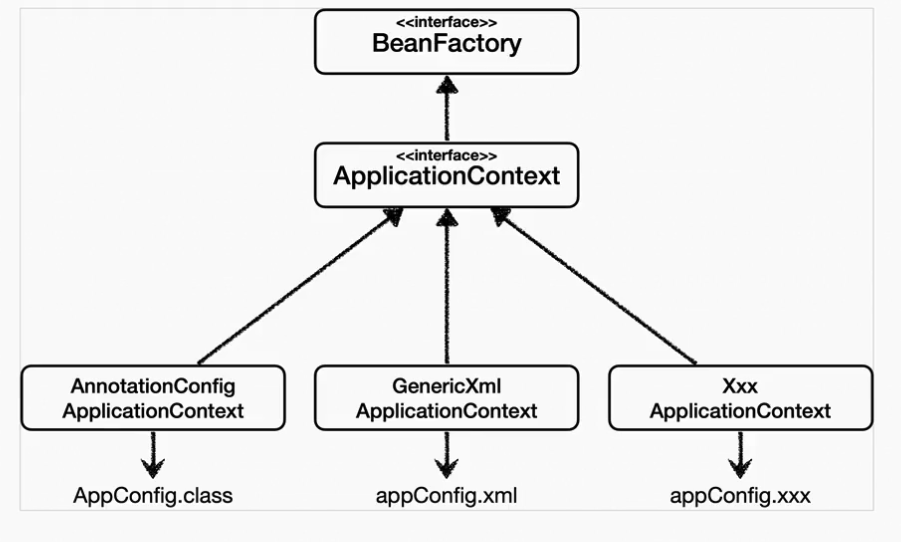
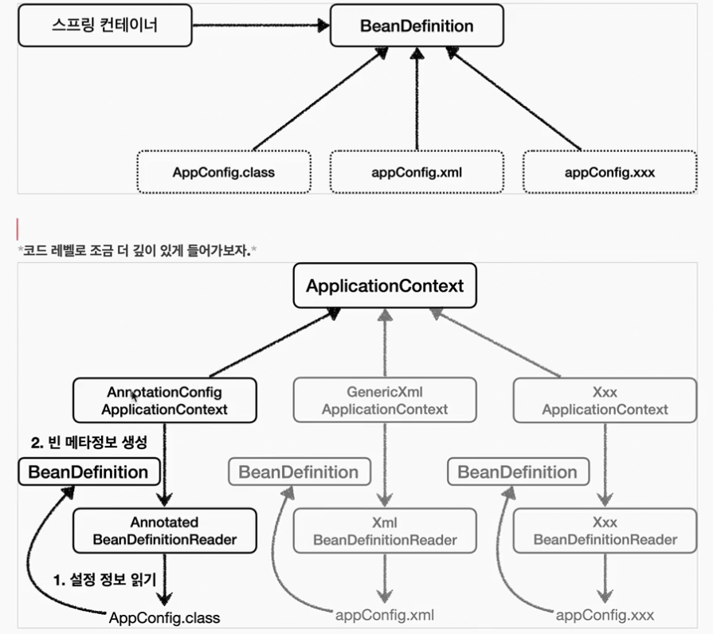
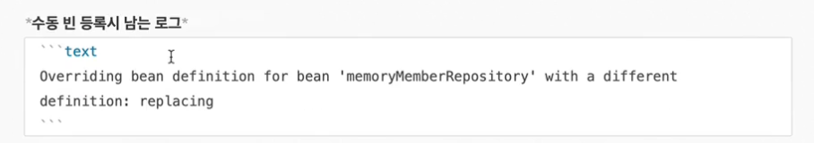
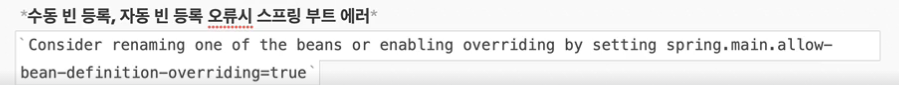

# 스프링 입문
+ ## MVC와 템플릿 엔진
  + 웹 브라우저 -> 톰캣 서버 -> 스프링 컨테이너안에 있는 Controller가 받아서 viewResolver로 웹 브라우저로 return
+ ## API
  + @ResponseBody 이용
    + 웹 브라우저 -> 톰캣 서버 -> 스프링 컨테이너안에 있는 Controller가 받아서 HttpMessateConverter로 웹 브라우저로 return
      + 기본 문자처리 : StringHttpMessageConverter
      + 기본 객체처리 : MappingJackson2HttpMessageConverter(JsonConverter)
+  ## 컴포넌트 스캔과 자동 의존관계 설정
  + @Autowired
    + 생성자에 @Autowired가 있으면 스프링이 연관된 객체를 스프링 컨테이너에서 찾아서 넣어준다.
    + 이렇게 객체의존 관계를 외부에서 넣어주는 것을 DI(Dependency Injection), 의존성 주입이라 한다.
    + 스프링은 스프링 컨테이너에 스프링 빈을 등록할 때, 기본으로 '싱글톤'으로 등록한다(유일하게 하나만 등록해서 공유한다.)
    + 따라서 같은 스프링 빈이면 모두 같은 인스턴스다.
    + 설정으로 싱글톤이 아니게 설정할 수 있지만, 특별한 경우를 제외하면 대부분 싱글톤을 사용한다.
  + @Component
    + 해당 애노테이션을 쓰면 스프링 빈으로 자동 등록된다.
  + @Controller
    + 컨트롤러가 스프링 빈으로 자동 등록된 이유도 컴포넌트 스캔 때문이다.
+ ## 주의 
  + Spring Boot 기준 
    + 컴포넌트 스캔시 main 메소드가 포함된 디렉토리에서만 컴포넌트 스캔이 적용된다.
    + 다른 디렉토리에서도 적용되게 하려면 @ComponentScan이 필요하다.
+ ## 순수 JDBC
  + 순서 
    1. Connection 연결 - Connection conn = getConnection();
    2. PrepareStatement 생성 - PrepareStatement pstmt = conn.prepareStatement(sql, Statement.RETURN_GENERATED_KEYS)
    3. 파라미터 세팅 - pstmt.setString(1, 데이터 값);
    4. ResultSet 세팅 - ResultSet rs = pstmt.getGeneratedKeys()
+ ## 주의
  + 꼭 connection을 close 해야한다.
+ ## Spring Data JPA
  + 인터페이스를 통한 기본적인 CRUD
  + 페이징 기능 자동 제공
+ ## Spring AOP
  + ProceedingJoinPoint = joinPoint.proceed()로 비즈니스 로직 실행시간 측정 가능

# 스프링 기본
+ ## Spring FrameWork
  + 핵심 기술 : 스프링 DI 컨테이너, AOP, 이벤트, 기타
  + 웹 기술 : 스프링 MVC, 스프링 WebFlux
  + 데이터 접근 기술 : 트랜잭션, JDBC, ORM지원, XML 지원
  + 기술 통합 : 캐시, 이메일, 원격접근, 스케줄링
  + 테스트 : 스프링 기반 테스트 지원
  + 언어 : 코틀린, 그루비
  
+ ## Spring Boot
  + 스프링을 편리하게 사용할 수 있도록 지원, 최근에는 기본으로 사용
  + 단독으로 실행할 수 있는 스프링 애플리케이션을 쉽게 생성
  + Tomcat 같은 웹 서버를 내장해서 별도의 우베 서버를 설치하지 않아도 됨
  + 손쉬운 빌드 구성을 위한 starter 종속성 제공
  + 스프링과 3rd parth(외부) 라이브러리 자동 구성
  + 메트릭, 상태 확인, 외부 구성 같은 프로덕션 준비 기능 제공
  + 관례에 의한 간결한 설정
  
+ ## IOC - 제어의 역전 (Inversion of Control)
  + 프로그램의 제어 흐름을 직접 제어하는 것이 아니라 외부에서 관리하는 것을 제어의 역전(IOC)이라 한다.
    + ex)
      + Junit
      
+ ## DI - 의존관계 주입 (Dependency Injection)

+ ## IOC 컨테이너 및 DI 컨테이너
  + AppConfig 처럼 객체를 생성하고 관리하면서 의존관계를 연결해 주는것을 <U>**IOC 컨테이너**</U> 또는 <U>**DI 컨테이너**</U> 라고 한다.
  + 의존관계 주입에 초점을 맞추어 최근에는 DI 컨테이너라 한다.
  + 또는 어샘블러, 오브젝트 팩토리 등으로 불리기도 한다.

+ ## 스프링 컨테이너
  + <U>**ApplicationContext**</U>를 스프링 컨테이너라 한다.
    + ex) AnnotationConfigApplicationContext ac = new AnnotationConfigApplicationContext(AppConfig.class);
  + <U>**ApplicationContext**</U>는 인터페이스이다.
  + XML 기반으로 만들 수 있고, 애노테이션 기반의 자바 설정 클래스로 반들 수 있다.
  + <U>**@Configuration**</U>이 붙은 설정 정보 구성을 사용하며 <U>**@Bean**</U>이 붙은 메소드를 모두 호출해서 반환된 객체를 스프링 컨테이너에 등록한다 (싱글톤 방식)
  + 스프링 컨테이너는 파라미터로 넘어온 설정 클래스 정보(default : 클래스 명의 맨 앞글자만 소문자로 사용)를 사용해서 스프링 빈을 등록한다.
  + 스프링 컨테이너는 설정 정보를 참고해서 의존관계를 주입(DI)한다.
  + 스프링 컨테이너의 기본 빈 등록방식은 <U>**싱글톤**</U>이지만 요청할 때 마다 새롱ㄴ 객체를 생성해서 반환하는 기능도 제공한다 (빈 스코프)
  + 스프링 컨테이너는 싱글톤 패턴을 적용하지 않아도, 객체 인스턴스를 싱글톤으로 관리한다.
  + 스프링 컨테이너는 싱글톤 컨테이너 역할을 한다. 이렇게 싱글톤 객체를 생성하고 관리하는 기능을 싱글톤 레지스트리라 한다.
  + 스프링 컨테이너의 이런 기능 덕분에 싱글톤 패턴의 모든 단점을 해결하면서 객체를 싱글톤으로 유지할 수 있다.
    + 싱글톤 패턴을 위한 지저분한 코드가 들어가지 않아도 된다.
    + DIP, OCP, 테스트 private 생성자로부터 자유롭게 싱글톤을 사용할 수 있다.

+ ## 스프링 Bean
  + BeanFactory와 ApplicationContext는 모두 스프링 컨테이너라고 한다.
  + 
    + ### BeanFactory
      + 스프링 컨테이너의 최상위 인터페이스다.
      + 스프링 빈을 관리하고 조회하는 역활을 담당한다.
      + getBeanDefinitionNames() 으로 모든 빈 조회 가능
      + getBean(빈 name, class) 으로 특정 빈 조회 가능
      + Role ROLE_APPLICATION : 직접 등록한 애플리케이션 빈
      + Role ROLE_INFRASTRUCTURE : 스프링이 내부에서 사용하는 빈
      + getBeansOfType() 으로 같은 class 타입으로 등록된 빈을 모두 조회 가능
      + 부모 타입으로 getBean() 조회시, 자식이 둘 이상 있으면, 중복 오류가 발생한다.
      + 부모 타입으로 getBean() 조회시, 자식이 둘 이상 있으면, 빈 이름을 지정하면 정상 작동한다.
    + ### ApplicationContext
      + BeanFactory 기능을 모두 상속받아서 제공한다. (인터페이스)
      + 빈 관리기능 + 편리한 부가 기능을 제공한다.
      + 애플리케이션을 개발할 때는 빈은 관리하고 조회하는 기능은 물론이고, 수 많은 부가기능이 필요하다.
        + ### 메시지 소스를 활용한 국제화 기능
          + ex) 한국에서 들어오면 한국어로, 영어권에서 들어오면 영어로 출력
        + ### 환경변수
          + local, dev, prod 등을 구분해서 처리
        + ### 애플리케이션 이벤트
          + 이벤트를 발행하고 구독하는 모델을 편리하게 지원
        + ### 편리한 리소스 조회
          + file, classpath, 외부 등에서 리소스를 편리하게 조회
    + ### BeanDefinition (스프링 빈 설정 메타정보)
      + <U>**BeanDefinition**</U>을 빈 설정 메타 정보라 한다.
        + @Bean, <bean> 당 각각 하나씩 메타 정보가 생성된다.
      + 스프링 컨테이너는 이 메타정보를 기반으로 스프링 빈을 생성한다.
      + XML을 읽어서 BeanDefinition을 만들면 된다.
      + 자바 코드를 읽어서 BeanDefinition을 만들면 된다.
      + 스프링 컨테이너는 자바 코드인지, XML인지 몰라도 된다. 오직 BeanDefinition만 알면 된다.
      + BeanClassName : 생성할 빈의 클래스 명(자바 설정 처럼 팩토리 역할의 빈을 사용하면 없음.)
      + factoryBeanName : 팩토리 역할의 빈을 사용할 경우 이름, 예) appConfig
      + factoryMethodName : 빈을 생성할 팩토리 메서트 지정, 예) memberService
      + Scope : 싱글톤(기본값)
      + lazyInit : 스프링 컨테이너를 생성할 때 빈을 생성하는 것이 아니라, 실제 빈을 사용할 때 까지 최대한 생성을 지연처리 하는지 여부
      + InitMethodName : 빈을 생성하고, 의존관계를 적용한 뒤에 호출되는 초기화 메서드 명
      + DestroyMethodName : 빈의 생명주기가 끝나서 제거하기 직전에 호출되는 메서드 명
      + Constructor arguments, properties : 의존관계 주입에서 사용한다. (자바 설정 처럼 팩토리 역할의 빈을 사용하면 없음.)
      + 
  + 수동 빈 생성과 자동 빈 생성
    + 수동 빈과 자동 빈이 겹칠 때는 수동 빈 생성 클래스가 우선 적용
      
    + 스프링 부트에선 수동 빈 및 자동 빈 등록 오류시 start 할 때 에러가 뜬다.
      
      
+ # @Component
  + 해당 애노테이션을 붙이면 스프링 컨테이너에 스프링 Bean으로 등록된다.
  + ### FilterType 옵션
    + ANNOTATION : 기본값, 애노테이션을 인식해서 동작한다.
    + ASSIGNABLE_TYPE : 지정한 타입과 자식 타입을 인식해서 동작한다.
      + ex) kr.co.spring.dip.discount.FixDiscountPolicy.class
    + ASPECTJ : AspectJ 패턴 사용
      + ex) kr.co.spring..*Service+
    + REGEX : 정규 표현식
      + ex) kr\.co\.spring\.dip.*
    + CUSTOM : <U>**TypeFilter**</U> 라는 인터페이스를 구현해서 처리
+ # @ComponentScan
  + 참고 : 컴포넌트 스캔을 사용하면 <U>**@Configuration**</U>이 붙은 설정 정보도 자동으로 등록되기 때문에, AppConfig, TestConfig 등
    앞서 만들어두었던 설정 정보도 함께 등록되고, 실행되어 버린다.  
    그래서 <U>**excludeFilters**</U>를 이용해서 설정 정보는 컴포넌트 스캔 대상에서 제외했다. 보통 설정 정보를 컴포넌트 스캔 대상에서 
    제외하지는 않지만, 기존 예제 코드를 최대한 남기고 유지하기 위해서 이 방법을 선택했다.
  + 컴포넌트 스캔은 이름 그대로 <U>**@Component**</U> 애노테이션이 붙은 클래스를 스캔해서 스프링 빈으로 등록한다.
  + 컴포넌트 스캔 대상
    + <U>**@Component**</U>
    + <U>**@Controller**</U> : 스프링 MVC 컨트롤러로 인식
    + <U>**@Service**</U> : 특별한 처리를 하지 않는다. 다만 개발자들이 비즈니스 계층을 인식하는데 도움이 됌
    + <U>**@Repository**</U> : 스프링 데이터 접근 계층으로 인식하고, 데이터 계층의 예외를 스프링 예외로 변환해준다. 
    + <U>**@Configuration**</U> : 스프링 설정 정보로 인식하고, 스프링 빈이 싱글톤을 유지하도록 추가 처리를 한다.

+ # 다양한 의존관계 설정
  + 종류 : 
    + 생성자 주입
      + 생성자 호출시점에 딱 1번만 호출되는 것이 보장된다.
      + <U>**불변, 필수**</U> 의존관계에 사용
      + 클래스마다 생성자가 1개일 떈 <U>**@AutoWired**</U> 생략 가능
    + 수정자 주입(setter 주입)
      + <U>**선택, 변경**</U> 가능성이 있는 의존관계에 사용
      + 자바 Bean 프로퍼티 규약의 수정자 메서드 방식을 사용하는 방법
    + 필드 주입 (@Autowired)
      + <U>**@Autowired**</U>는 타입매칭을 시도하고, 이때 여러 빈이 있으면 필드 이름, 파라미터 이름으로 빈 이름을 추가 매칭한다.
      + 빈이 2개 이상일 때
        + <U>**@Qualifier**</U> 
          + <U>**@Qualifier**</U> 로도 찾지 못하면 스프링 빈 이름으로 추가로 찾는다. 하지만 경험상 <U>**@Qualifier**</U>는 <U>**@Qualifier**</U>를 찾는 용도로만 사용하는게 명확하고 좋다.
          + 정리
            1. @Qualifier 끼리 매칭
            2. 빈 이름 매칭
            3. 1과 2도 존재하지 않으면 NoSuchBeanDefinitionException 예외 발생
        + <U>**@Primary**</U>
    + 일반 메서드 주입
  + 결론 : 
    + 생성자 주입을 선택해라!
      + <U>**불변**</U>
        + 대부분의 의존관계 주입은 한번 일어나면 애플리케이션 종료시점까지 의존관계를 변경할 일이 없다. 오히려 대부분의 의존관계는 애플리케이션 종료 전까지 변하면 안된다.
        + 수정자 주입을 사용하면, setXxx 메서드를 public으로 열어두어야 한다.
        + 누군가 실수로 변경할 수도 있고, 변경하면 안되는 메서드를 열어두는 것은 좋은 설계 방법이 아니다.
        + 생성자 주입은 객체를 생성할 때 딱 한번만 호출되므로 이후에 호출되는 일이 없다. 따라서 불변하게 설계할 수 있다.
      + <U>**final 키워드**</U>
        + 생성자 주입을 사용하면 필드이 final 키워드를 사용할 수 있다. 그래서 생성자에서 혹시라도 값이 설정되지 않는 오류를 컴파일 시점에 막아준다.
      + 정리
        + 생성자 주입 방식을 선택하는 이유는 여러가지가 있지만, 프레임어크에 의존하지 않고, 순수한 자바 언어의 특징을 잘 살리는 방법 이기도 하다.

+ # 애노테이션
  + 애노테이션에는 상속이라는 개념이 없다. 이렇게 여러 애노테이션을 모아서 사용하는 기능은 스프링이 지원해 주는 기능이다.

+ # 스프링 CGLIB
  + <U>**@Configuration**</U>을 붙일 때
    + 스프링 CGLIB를 이용한 스프링 Bean이 생성된다.
  + <U>**@Configuration**</U>을 붙이지 않을 때
    + 싱글톤 패턴이 깨지면서 순수 자바 new 객체를 생성한 것과 같다.

+ # 디자인 패턴
  + ## 싱글톤 패턴
    + 개요
      + 클래스의 인스턴스가 딱 1개만 생성되는 것을 보장하는 디자인 패턴이다.
      + 그래서 객체 인스턴스를 2개 이상 생성하지 못하도록 막아야 한다.
        + private 생성자를 사용해서 외부에서 임의로 new 키워드를 사용하지 못하도록 막야아 한다.
    + 주의점
      + 객체 인스턴스를 하나만 생성해서 공유하는 싱글톤 방식은 여러 클라이언트가 하나의 같은 객체 인스턴스를 공유하기때문에  
        싱글톤 객체는 상태를 유지(stateful)하게 설계하면 안된다.
      + 무상태(stateless)로 설계해야한다.
        + 특정 클라이언트에 의존적인 필드가 있으면 안된다.
        + 특정 클라이언트가 값을 변경할 수 있는 필드가 있으면 안된다.
        + 가급적 읽기만 가능해야 한다.
        + 필드 대신에 자바에서 공유되지 않는, 지역변수, 파라미터, ThreadLocal 등을 사용해야한다.
        + 스프링 빈의 필드에 공유값을 설정하면 정말 큰 장애가 발생할 수 있다.
    + 장단점
      + 장점 : 
      + 단점 :
        + 싱글톤 패턴을 구현하는 코드 자체가 많이 들어간다.
        + 의존관계상 클라이언트가 구체화된 클래스에 의존한다. -> DIP를 위반한다.
        + 클라이언트가 구체화된 클래스에 의존해서 OCP 원칙을 위반할 가능성이 높다.
        + 테스트하기 어렵다.
        + 내부 속성을 변경하거나 초기화 하기 어렵다.
        + private 생성자로 자식 클래스를 만들기 어렵다.
        + 결론적으로 유연성이 떨어진다.
        + <U>**안티패턴**</U>으로 불리기도 한다.

+ # 객체지향 프로그래밍
  + 컴퓨터 프로그램을 명령어의 목록으로 보는 시각에서 벗어사 여러개의 독립된 단위, 
    즉 <U>**객체**</U>들의 모임으로 파악하고자 하는 것이다.
    각각의 객체는 메시지를 주고받고, 데이터를 처리할 수 있다.
  + 프로그램을 유연하고 변경이 용이하게 만들기 때문에 대규모 스프링 소프트웨어 개발에 많이 사용된다.
  + ## 역활과 구현을 분리
    + 역활과 구현으로 구분하면 세상이 단순해지고, 유연해지며 변경도 편리해딘다
    + 장점
      + 클라이언트는 대상의 역할(인터페이스)만 알면 된다.
      + 클리이언트는 구현 대상의 내부 구조를 몰라도 된다.
      + 클라이언트는 구현 대상의 내부 구조가 변경되어도 영향을 받지 않는다.
        + 클라이언트는 구현 대상 자체를 변경해도 영향을 받지 않는다.
    + 자바 언어의 다형성을 활용
      + ### 역할 : 인터페이스
      + ### 구현 : 인터페이스를 구현한 클래스 구현 객체
    + 객체를 설계할 때 역할과 구현을 명확히 분리
    + 객체 설계시 역할(인터페이스)을 먼저 부여하고, 그 역할을 수행하는 구현 객체 만들기
  + ## 다형성의 본질
    + 인터페이스를 구현한 객체 인스턴스를 실행 시점에 유연하게 변경할 수 있다.
    + 다형성의 본질을 이해하려면 협력이라는 객체사이의 관계에서 시작해야함
    + 클라이언트를 변경하지 않고, 서버의 현 기능을 유연하게 변경할 수 있다.
    
+ # SOLID 5원칙
  + ## SRP 단일 책임의 원칙
    + 클라이언트 객체는 직접 구현 객체를 생성하고, 연결하고, 실행하는 다양한 책임을 가지고 있음
    + SRP 단익책임 원칙을 따르면서 관심사를 분리함
    + 구현 객체를 생성하고 연결하는 책임은 AppConfig가 담당
    + 클라이언트 객체는 실행하는 책임만 담당
  + ## DIP 의존관계 역전 원칙
    + 추상화에 의존 하되 구체화에 의조하면 안된다.
  + ## OCP 
    + 소프트웨어 요소는 확장에는 열려있으나 변경에는 닫혀 있어야 한다.
    + 다형성 사용하고 클라이언트가 DIP를 지킴
    + 애플리케이션을 사용 영역과 구성 영역으로 나눔

+ ## AppConfig의 등장
  + 애플리케이션의 전체 동작 방식을 구성(config) 하기 위해, <U>**구현 객체를 생성**</U>하고, <U>**연결**</U>하는 책임을 가니는 별도의
    설정 클래스
  + 객체의 생성과 연결은 AppConfig가 담당한다.  